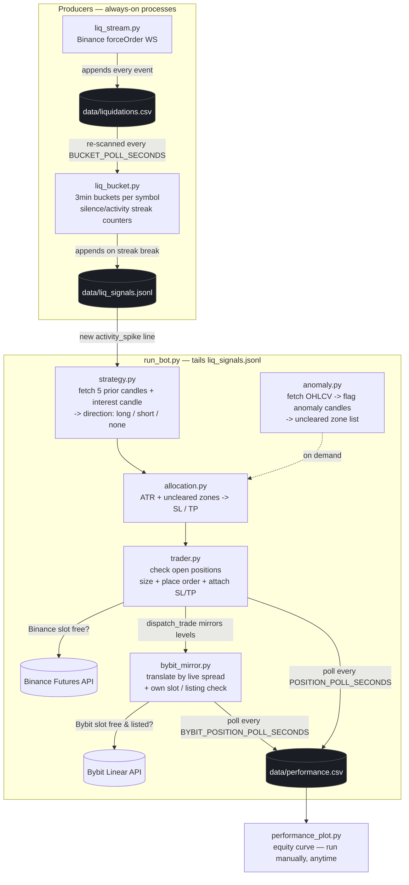

# Liquidation Trading System — Architecture

## The map



## Processes vs. modules

Two things are running independently as **long-lived processes**:

| Process | File | Role |
|---|---|---|
| 1 | `liq_stream.py` | Streams Binance liquidations, logs every one to `data/liquidations.csv` |
| 2 | `liq_bucket.py` | Re-buckets that CSV every few seconds, tracks silence/activity streaks per symbol, appends signals to `data/liq_signals.jsonl` |
| 3 | `run_bot.py` | Tails the signals file; for each trigger it calls the other four modules **as plain Python function calls, in-process** (no queue needed — the decision chain is inherently sequential) |

`strategy.py`, `allocation.py`, `anomaly.py`, `trader.py`, and `bybit_mirror.py` are **not** separate processes — they're libraries `run_bot.py` imports. That keeps a single trade decision (direction → levels → execution) atomic and easy to trace, while the two data producers stay decoupled so either can restart independently without losing the other's state (`liq_bucket.py` persists its streak counters to `data/liq_bucket_state.json`).

`performance_plot.py` is a fourth, separate, on-demand script — run it whenever you want to look at the equity curve; it only reads `data/performance.csv` and never touches the live pipeline.

## Bybit mirror

Every trade the system finalizes is dispatched to **both** exchanges as independent adapters:

- **`trader.py`** executes on Binance (limit entry + STOP_MARKET/TAKE_PROFIT_MARKET attached on fill).
- **`bybit_mirror.py`** re-executes the same `levels` dict on Bybit linear via `Trader.dispatch_trade()`.

**Spread translation.** Binance and Bybit never quote identical prices, so the mirror fetches Bybit's live close for the coin at decision time and shifts the whole trade by the spread:

```
spread      = bybit_close - binance_entry
bybit_entry = binance_entry + spread   (= Bybit's current close)
bybit_sl    = binance_sl  + spread
bybit_tp    = binance_tp  + spread
```

The same absolute spread is added to entry, SL and TP, so risk and reward distances (and therefore R:R) are preserved exactly and the Bybit PnL mirrors Binance's. Bybit's native TP/SL ride on the LIMIT entry itself via the `stopLoss`/`takeProfit` triggerPrice object params, which ccxt keeps on Bybit's place-order endpoint (`/v5/order/create`) so the resting order carries its SL/TP — nothing needs to be attached on fill. (The flat `stopLossPrice`/`takeProfitPrice` params must NOT be used: ccxt routes those to the trading-stop endpoint `/v5/position/trading-stop`, which requires an existing position and fails with `can not set tp/sl/ts for zero position`.)

**Per-exchange independence** (the "flexible / per-exchange" requirements):

- Each exchange has its **own** `MAX_CONCURRENT_POSITIONS` cap (`3` on Binance, `BYBIT_MAX_CONCURRENT_POSITIONS` on Bybit) and its **own** per-trade dollar allocation (`RISK_PER_TRADE_USD` vs `BYBIT_RISK_PER_TRADE_USD`). The run_bot capacity gate only blocks a signal when *every* enabled exchange is full — Binance at 3/3 with Bybit at 2/3 still proceeds so Bybit takes the trade.
- A symbol that isn't listed on Bybit (or whose Bybit close can't be pulled) **aborts the Bybit side only** and waits for the next pull — Binance is unaffected. That's how Bybit can hold 2/3 slots while Binance is full: Bybit simply skips the coins it can't trade.
- One-exchange operation works: no Bybit keys → Binance-only; no Binance keys → the mirror can still execute on Bybit (strategy still reads Binance *public* data).
- Each adapter runs its own entry follower (cancel unfilled LIMITs at their fill window) and monitor loop (P&L → `performance.csv`, tagged by exchange).

## Data contracts

- **`data/liquidations.csv`** — one row per liquidation event (see `liq_stream.py`'s `CSV_FIELDS`).
- **`data/liq_signals.jsonl`** — one JSON object per line: `{time, bucket_start, symbol, signal, count_in_bucket, prior_streak}`. `signal` is `"activity_spike"` or `"collapse"`.
- **`data/liq_bucket_state.json`** — per-symbol `{last_bucket, silent, active}` counters, so a `liq_bucket.py` restart doesn't reset streaks.
- **`data/trade_log.jsonl`** — audit trail of every `opened` / `closed` / `order_failed` event from `trader.py` and `bybit_mirror.py`, each tagged with an `exchange` field.
- **`data/performance.csv`** — one row per PnL poll while a position is open, plus a final `closed` row. Rows from both exchanges share one file; a trailing `exchange` column (`binance` / `bybit`) tells them apart.

## Running locally in VS Code

Open four terminals (or use a multi-terminal / tasks.json setup) in the project root:

```bash
pip install -r requirements.txt
cp .env.example .env   # fill in your API keys, leave LIQ_TESTNET=true first

# terminal 1
python liq_stream.py

# terminal 2 (after liq_stream.py has a few minutes of data)
python liq_bucket.py

# terminal 3
python run_bot.py

# terminal 4, whenever you want to look at results
python performance_plot.py
```

`config.py` is the only file you should need to edit to tune behavior — bucket size, thresholds, ATR multiples, risk %, contrarian vs. trend-following mode, testnet vs. live. Bybit mirror behavior (demo flag, per-exchange allocation, per-exchange concurrent cap) is configured with the `BYBIT_*` variables in `.env` — see the Bybit mirror section above.

## Cloud deployment

`docker-compose.yml` runs the five long-lived processes (`dash`, `liq_stream`, `liq_bucket`, `bot`, `maintenance`) as separate containers sharing one `liq_data` named volume mounted at `/data` — the same file-based contract as local dev, so no code changes are needed between environments.

```bash
cp .env.example .env    # fill in real keys on the server; keep LIQ_TESTNET=true until you've watched it run
docker compose up -d --build
docker compose logs -f bot
```

`restart: unless-stopped` means each service reconnects/resumes on its own after a crash or host reboot — `liq_bucket.py`'s persisted state and `run_bot.py`'s tail-from-current-position behavior both handle mid-stream restarts safely. `maintenance.py` trims the unbounded CSV/JSONL files back to their caps so a small disk never fills up.

For single-container hosts (Railway) the image's default `CMD` runs `entrypoint.py`, which supervises all five stages in one process (including `dash` on the platform-injected `$PORT`). See `RAILWAY.md` for the full step-by-step.

## Before going live

- Leave `LIQ_TESTNET=true` until you've watched a full day of signals, directions, and allocation output and agree with what it's doing.
- `RISK_PER_TRADE_USD` and `LEVERAGE` in `config.py`/`.env` directly control how much is at stake per trade — size these deliberately.
- `trader.py` and `bybit_mirror.py` each enforce their own per-exchange concurrent-position cap by checking `fetch_positions()` (plus resting entries) before every entry, but that check has a small race window under high signal frequency; if you're running multiple symbols concurrently through one account, consider adding an explicit lock file too.
