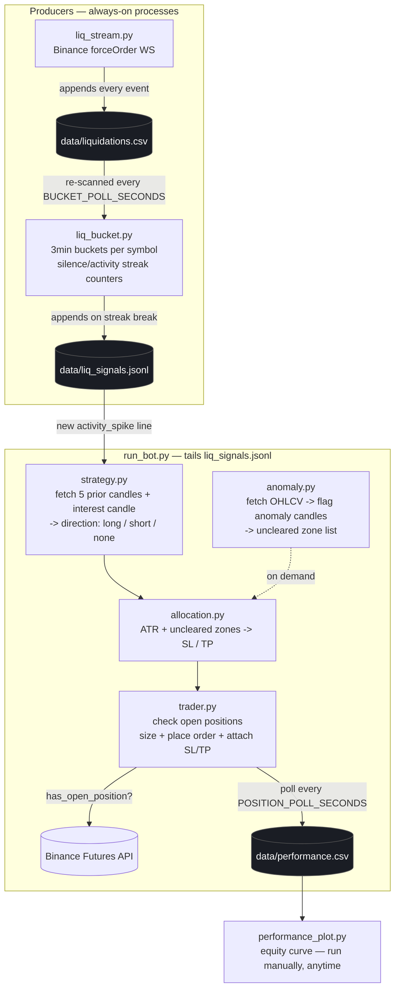

# Liquidation Trading System — Architecture

## The map



## Processes vs. modules

Two things are running independently as **long-lived processes**:

| Process | File | Role |
|---|---|---|
| 1 | `liq_stream.py` | Streams Binance liquidations, logs every one to `data/liquidations.csv` |
| 2 | `liq_bucket.py` | Re-buckets that CSV every few seconds, tracks silence/activity streaks per symbol, appends signals to `data/liq_signals.jsonl` |
| 3 | `run_bot.py` | Tails the signals file; for each trigger it calls the other four modules **as plain Python function calls, in-process** (no queue needed — the decision chain is inherently sequential) |

`strategy.py`, `allocation.py`, `anomaly.py`, and `trader.py` are **not** separate processes — they're libraries `run_bot.py` imports. That keeps a single trade decision (direction → levels → execution) atomic and easy to trace, while the two data producers stay decoupled so either can restart independently without losing the other's state (`liq_bucket.py` persists its streak counters to `data/liq_bucket_state.json`).

`performance_plot.py` is a fourth, separate, on-demand script — run it whenever you want to look at the equity curve; it only reads `data/performance.csv` and never touches the live pipeline.

## Data contracts

- **`data/liquidations.csv`** — one row per liquidation event (see `liq_stream.py`'s `CSV_FIELDS`).
- **`data/liq_signals.jsonl`** — one JSON object per line: `{time, bucket_start, symbol, signal, count_in_bucket, prior_streak}`. `signal` is `"activity_spike"` or `"collapse"`.
- **`data/liq_bucket_state.json`** — per-symbol `{last_bucket, silent, active}` counters, so a `liq_bucket.py` restart doesn't reset streaks.
- **`data/trade_log.jsonl`** — audit trail of every `opened` / `closed` / `order_failed` event from `trader.py`.
- **`data/performance.csv`** — one row per PnL poll while a position is open, plus a final `closed` row.

## Running locally in VS Code

Open four terminals (or use a multi-terminal / tasks.json setup) in the project root:

```bash
pip install -r requirements.txt
cp .env.example .env   # fill in your API keys, leave LIQ_TESTNET=true first

# terminal 1
python liq_stream.py

# terminal 2 (after liq_stream.py has a few minutes of data)
python liq_bucket.py

# terminal 3
python run_bot.py

# terminal 4, whenever you want to look at results
python performance_plot.py
```

`config.py` is the only file you should need to edit to tune behavior — bucket size, thresholds, ATR multiples, risk %, contrarian vs. trend-following mode, testnet vs. live.

## Cloud deployment

`docker-compose.yml` runs the three long-lived processes (`liq_stream`, `liq_bucket`, `bot`) as separate containers sharing a `./data` volume — the same file-based contract as local dev, so no code changes are needed between environments.

```bash
cp .env.example .env    # fill in real keys on the server; keep LIQ_TESTNET=true until you've watched it run
docker compose up -d --build
docker compose logs -f bot
```

`restart: unless-stopped` means each service reconnects/resumes on its own after a crash or host reboot — `liq_bucket.py`'s persisted state and `run_bot.py`'s tail-from-current-position behavior both handle mid-stream restarts safely.

## Before going live

- Leave `LIQ_TESTNET=true` until you've watched a full day of signals, directions, and allocation output and agree with what it's doing.
- `RISK_PER_TRADE_PCT` and `LEVERAGE` in `config.py`/`.env` directly control how much of the account is at stake per trade — size these deliberately.
- `trader.py` enforces one open position at a time by checking `fetch_positions()` before every entry, but that check has a small race window under high signal frequency; if you're running multiple symbols concurrently through one account, consider adding an explicit lock file too.
